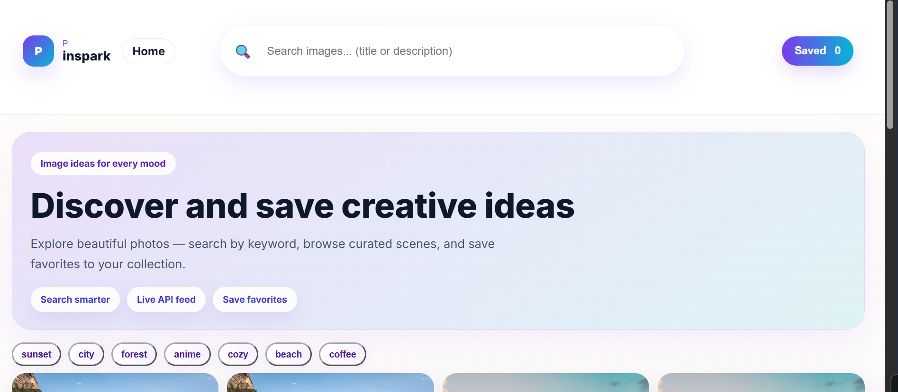
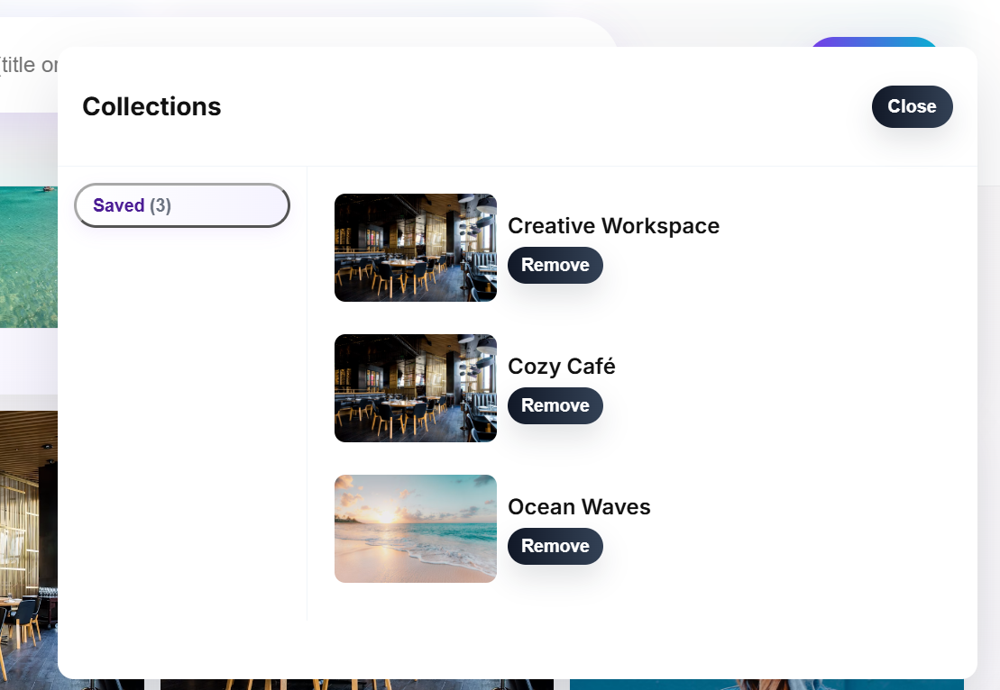

# 📌 Pinspire

A Pinterest-inspired image discovery platform built using React and Vite. This project recreates the modern Pinterest interface with a responsive masonry grid, smooth navigation, and a clean user experience.

---

## 🚀 Features

- 🖼️ Responsive Masonry Layout
- 🔍 Image Search
- 📌 Pin Cards
- ❤️ Save Pins UI
- 👤 User Profile
- 📱 Fully Responsive Design
- ⚡ Fast Performance with Vite
- 🎨 Modern UI

---

## 🛠️ Tech Stack

- React.js
- Vite
- JavaScript (ES6+)
- HTML5
- CSS3
- React Router
- Unsplash API *(if you use it)*

---

## 📂 Project Structure

```
src/
│── assets/
│── components/
│── pages/
│── App.jsx
│── main.jsx
```

---

## 📸 Screenshots

### 🏠 Home Page



### 🔍 Search Page



---

## ⚙️ Installation

Clone the repository

```bash
git clone https://github.com/akanksha-codepy/Pinspire.git
```

Go to the project directory

```bash
cd Pinspire
```

Install dependencies

```bash
npm install
```

Run the development server

```bash
npm run dev
```

---

## 🎯 Future Improvements

- Authentication
- Save Pins
- Create Pin
- Infinite Scrolling
- Dark Mode
- User Dashboard

---

## 👩‍💻 Author

**Akanksha Uchale**

GitHub: https://github.com/akanksha-codepy

Portfolio: https://akanksha-uchale-portfolio.netlify.app/

LinkedIn: https://www.linkedin.com/in/akanksha-uchale/

---

## ⭐ Support

If you like this project, consider giving it a ⭐ on GitHub.